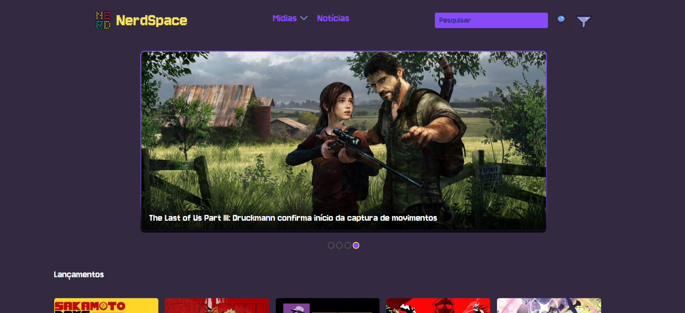
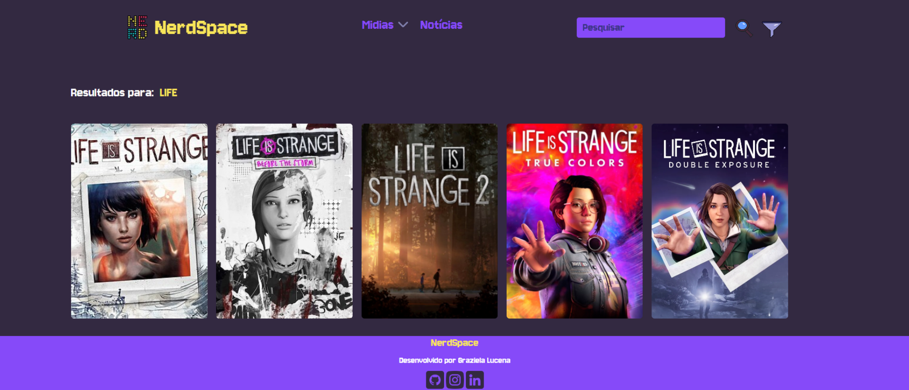
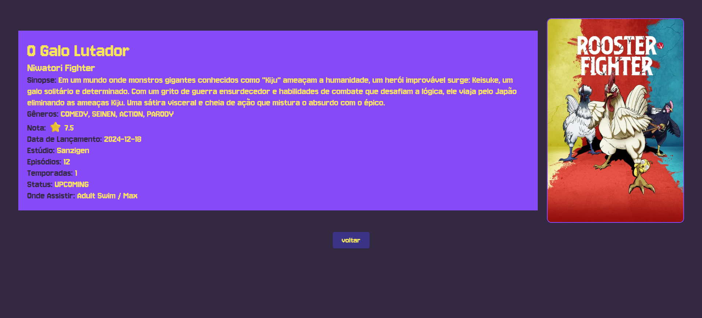
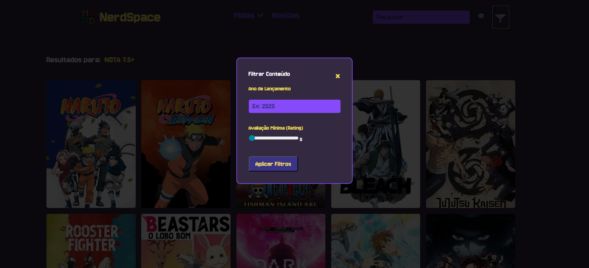
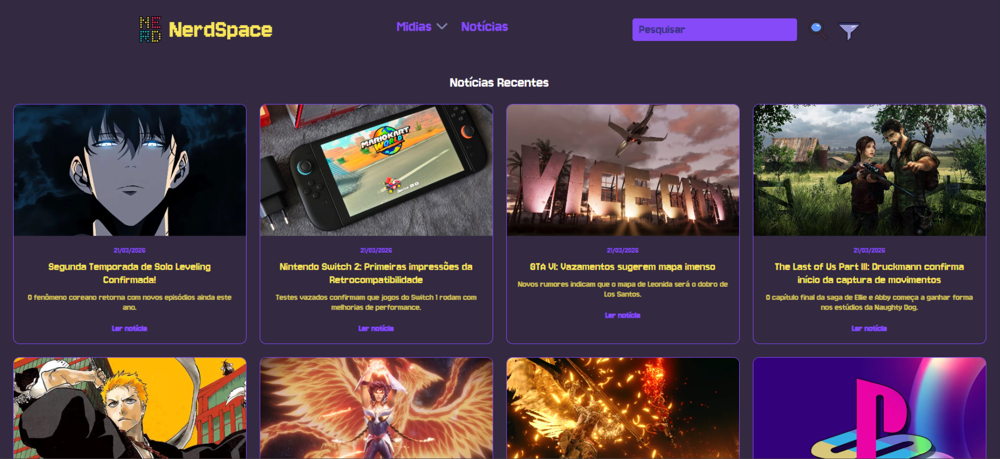

# 🌌NerdSpace

O **NerdSpace** é uma API de catálogo e gerenciamento de mídias da cultura geek, abrangendo **Animes, Filmes, Livros, Jogos e Mangás**.
O projeto foi desenvolvido com **Java 21** e **Spring Boot 3**, com foco em uma arquitetura limpa, integridade de dados e filtragem dinâmica.

A ideia principal foi criar um sistema unificado de mídias, mas mantendo flexibilidade para cada tipo ter suas próprias características.

---

## 📸 Preview












---

<div class="languages-svg" align="center">
        
        
        
        
        
        
</div>

---

## Tecnologias Utilizadas

### Backend

* **Java 21 (LTS)**
  Uso de *Records* para DTOs imutáveis, deixando o código mais enxuto e seguro.

* **Spring Boot 3**
  Base da aplicação REST, responsável pela configuração e estrutura geral do sistema.

* **Spring Data JPA**
  Gerenciamento das entidades e persistência de dados com suporte a herança polimórfica.

* **MySQL**
  Banco de dados relacional utilizado para armazenamento das informações.

* **JUnit 5 & Mockito**
  Testes automatizados para validar controllers, repositórios e lógica de conversão.

---

### Frontend

* **JavaScript (Vanilla)**
  Comunicação assíncrona com a API utilizando **Fetch API**.

* **CSS3**
  Estilização personalizada com foco em responsividade (*Mobile First*).

* **HTML5**
  Estrutura semântica com carregamento dinâmico de conteúdo.

---

## Funcionalidades Principais

### Catálogo Polimórfico

Sistema unificado que gerencia diferentes tipos de mídia através de herança JPA (estratégia `JOINED`).
Isso permite que cada tipo (Jogo, Livro, Anime, etc.) tenha seus próprios atributos, sem duplicar estrutura.

---

### Filtros Dinâmicos

Busca avançada utilizando:

* Título (*case insensitive*)
* Ano de lançamento
* Nota mínima

As consultas são feitas com **JPQL customizado**, garantindo flexibilidade e desempenho.

---

### Interface Responsiva

Interface adaptada para diferentes tamanhos de tela, permitindo uso confortável tanto em **desktop** quanto em **dispositivos móveis**.

---

### Segurança e Confiabilidade

Cobertura de testes automatizados que ajudam a evitar erros comuns, como:

* Falhas de serialização JSON
* Recursão infinita em relacionamentos
* Quebras de endpoint

---

## Estrutura do Projeto

```text
src/main/java/br/com/lucena/nerdspace/
├── controller/     # Endpoints REST (Game, Book, Anime, Media, etc.)
├── model/          # Entidades JPA e classes de herança
├── repository/     # Interfaces de acesso ao banco de dados
└── dto/            # Records para transferência de dados imutáveis

src/main/resources/static/
├── css/            # Folhas de estilo com media queries
├── js/             # Lógica de interação e consumo da API
└── *.html          # Páginas dinâmicas da interface
```

---

## Como Executar o Projeto

### 1. Clonar o repositório

```bash
git clone https://github.com/grazixzdev/nerdspace.git
```

---

### 2. Configurar o Banco de Dados

* Execute o script:

```sql
database_nerdspace.sql
```

* Ajuste as credenciais no arquivo:

```properties
src/main/resources/application.properties
```

---

### 3. Rodar a aplicação

```bash
./mvnw spring-boot:run
```

---

### 4. Acessar a interface

Abra diretamente:

```text
index.html
```

ou acesse:

```text
http://localhost:8080/index.html
```

---

## Sobre o Projeto

Este projeto foi desenvolvido como parte do processo de consolidação de conhecimentos em **Java**, **Spring Boot** e desenvolvimento **Full-Stack**, com foco em boas práticas de arquitetura, organização de código e integração entre backend e frontend.

---

**Desenvolvido por Graziela Lucena**
